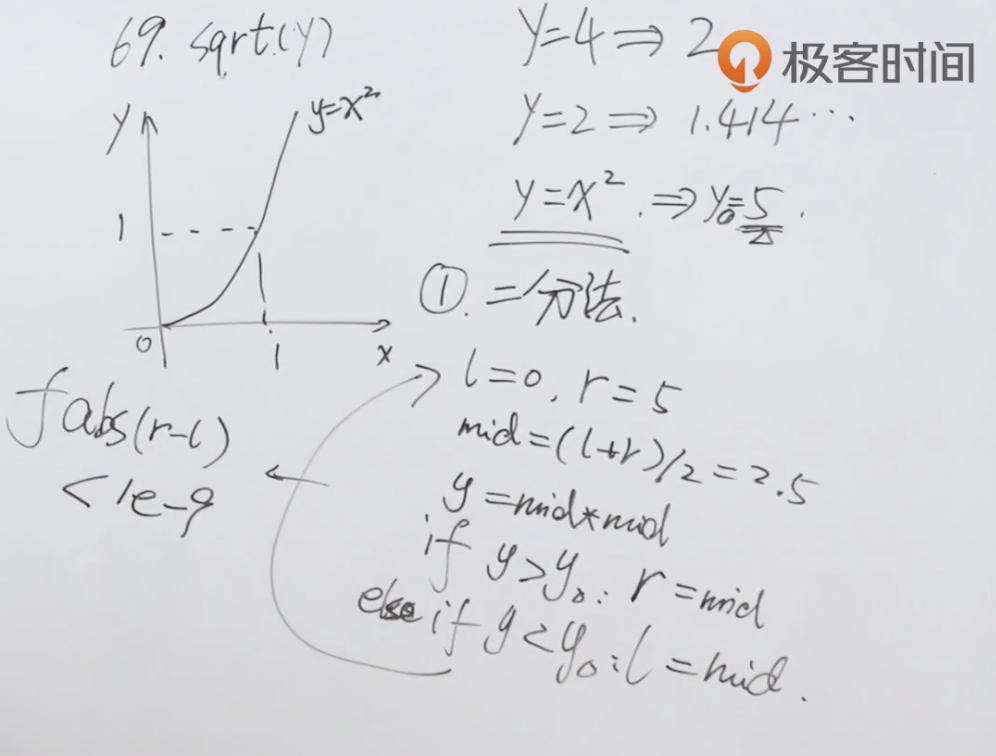
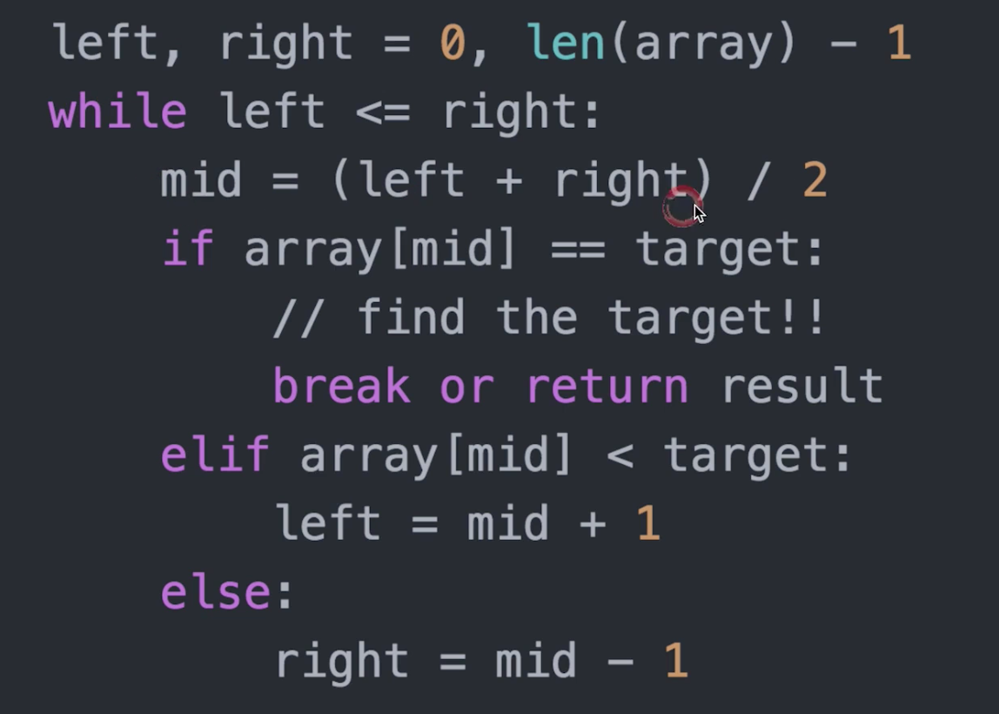

题目：实现 int sqrt(int x) 函数。

计算并返回 x 的平方根，其中 x 是非负整数。

由于返回类型是整数，结果只保留整数的部分，小数部分将被舍去。

示例1：

```shell
输入: 4
输出: 2
```

示例2：

```shell
输入: 8
输出: 2
说明: 8 的平方根是 2.82842..., 
     由于返回类型是整数，小数部分将被舍去。
```

解题思路：使用二分法，相当于枚举，不断逼近结果。



提供二分法的模板：



代码：

```java
class Solution {
    public int mySqrt(int x) {
        if(x == 0 || x==1) return x;
      	//定义左右边界
        int l = 1, r = x;
      	//定义结果
        int res = 0;
      	//二分法模板，左边界小于右边界
        while (l <= r) {
          	//取中间值进行比较
            int mid = (l+r) / 2;
          	//这里不用mid的平方的原因是测试用例会导致超出int最大值
            if(mid == x/mid) {
                return mid;
            } else if (mid > x/mid) { //x小于mid的平方，说明x在左侧，因此移动右边界减一
                r = mid -1;
            } else {
                l = mid +1;
              	//重新记录res
                res = mid;
            }
        }
        return res;
    }
}
```

