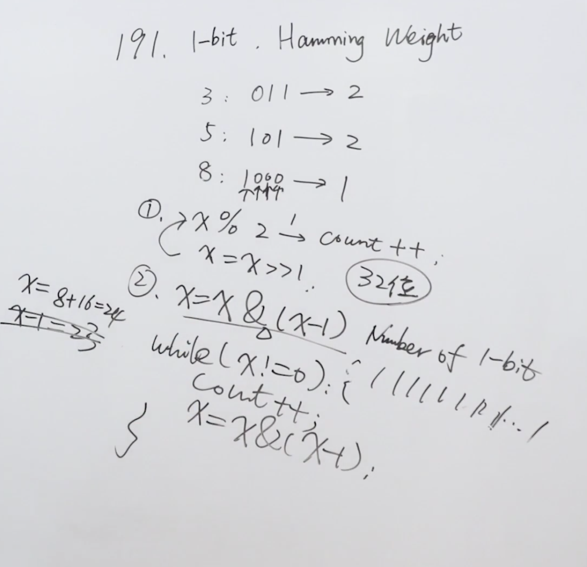

题目：编写一个函数，输入是一个无符号整数（以二进制串的形式），返回其二进制表达式中数字位数为 '1' 的个数（也被称为汉明重量）。

提示：

请注意，在某些语言（如 Java）中，没有无符号整数类型。在这种情况下，输入和输出都将被指定为有符号整数类型，并且不应影响您的实现，因为无论整数是有符号的还是无符号的，其内部的二进制表示形式都是相同的。
在 Java 中，编译器使用二进制补码记法来表示有符号整数。因此，在上面的 示例 3 中，输入表示有符号整数 -3。

示例1：

```shell
输入：00000000000000000000000000001011
输出：3
解释：输入的二进制串 00000000000000000000000000001011 中，共有三位为 '1'。
```

示例2：

```shell
输入：00000000000000000000000010000000
输出：1
解释：输入的二进制串 00000000000000000000000010000000 中，共有一位为 '1'。
```

解题思路：这道题有两种解法，一种是使用位移，对二进制数的每一位进行取余，余数为1则count++，依次执行；二是使用清除最后位的1，每次清除一个1就count++。



代码：

```java
public class Solution {
    public int hammingWeight(int n) {
        int count = 0;
      	//循环条件，当n清理最后一位1的过程中没有变为0时
        while (n != 0) {
            //清理最后一位的1
            n &= n-1;
            //清理多少次就有多少个1
            count++;
        }
        return count;
    }
}
```

