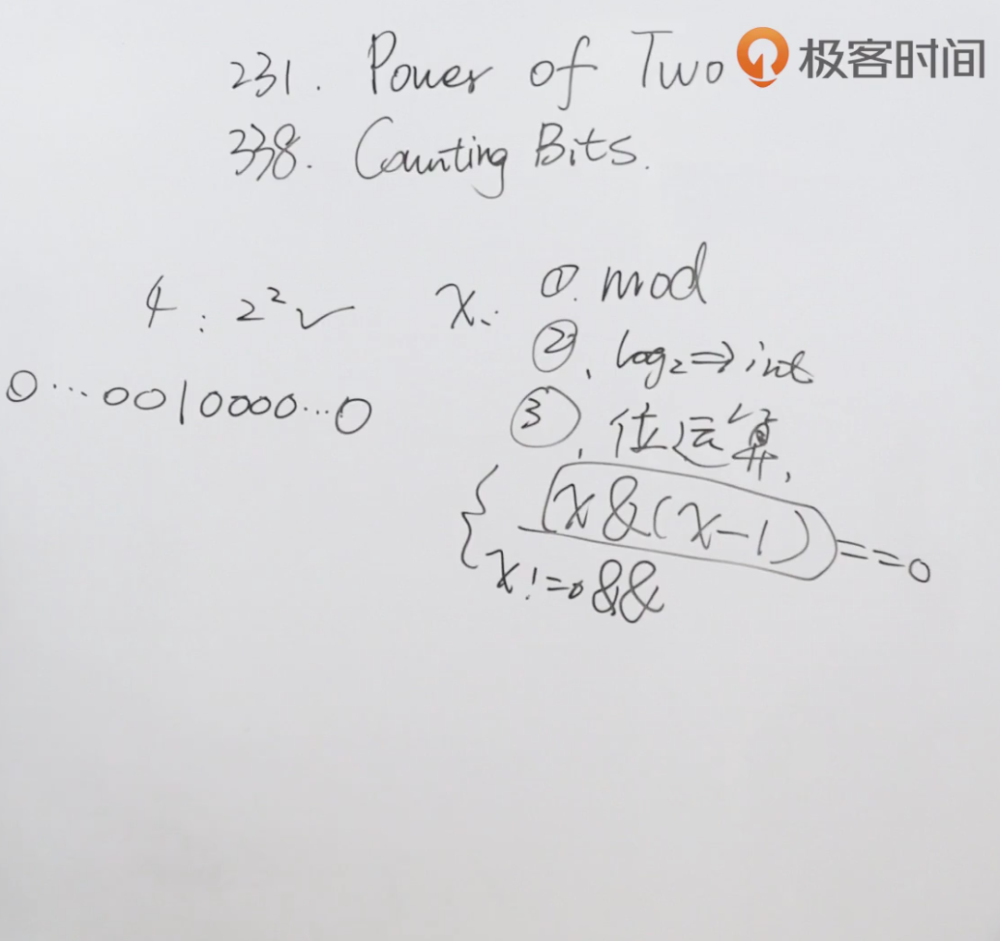

题目：给你一个整数 n，请你判断该整数是否是 2 的幂次方。如果是，返回 true ；否则，返回 false 。

如果存在一个整数 x 使得 n == 2x ，则认为 n 是 2 的幂次方。

示例1：

```shell
输入：n = 1
输出：true
解释：20 = 1
```

示例2：

```shell
输入：n = 16
输出：true
解释：24 = 16
```

示例3：

```shell
输入：n = 3
输出：false
```

解题思路：利用2的幂的二进制都只有一位为1的特点，使用n&(n-1)清除最后一位的1，如果为0则为2的幂。



代码：

```java
class Solution {
    //因为2的幂有一个特点就是他们的二进制都只有一位是1，其余全都是0
    //因此使用n&(n-1)清掉最后一位的1，二进制就都会变为0
    public boolean isPowerOfTwo(int n) {
        return n > 0 && (n&(n-1)) ==0;
    }
}
```

