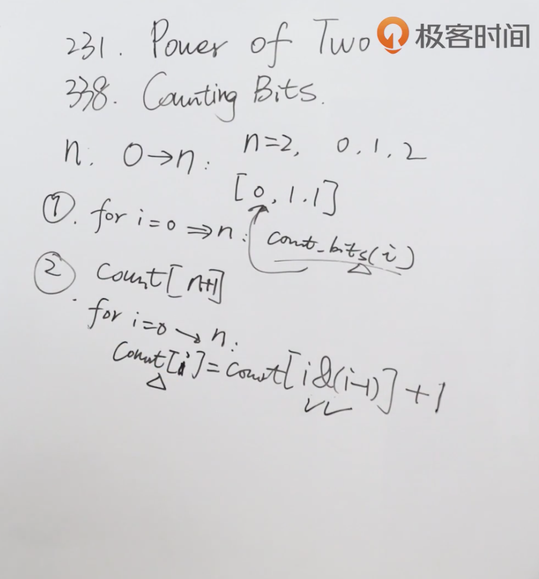

题目：给定一个非负整数 **num**。对于 **0 ≤ i ≤ num** 范围中的每个数字 **i** ，计算其二进制数中的 1 的数目并将它们作为数组返回。

示例1：

```shell
输入: 2
输出: [0,1,1]
```

示例2：

```shell
输入: 5
输出: [0,1,1,2,1,2]
```

解题思路：可以使用191题中求1的个数的方法，求出每个数的二进制的1的个数。



代码：

```java
class Solution {
    public int[] countBits(int n) {
      	//从0->n，一共有n+1个数，所以数组会有n+1个结果
        int[] result = new int[n+1];
      	//对0->n进行循环
        for (int i = 0; i <= n; i++) {
          	//求出每个数的二进制1的个数
            int i1 = hammingWeight(i);
            result[i] = i1;
        }
        return result;
    }

  	//求n的二进制1的个数
    public int hammingWeight(int n) {
        int count = 0;
        while (n != 0) {
            n &= n-1;
            count++;
        }
        return count;
    }
}
```

