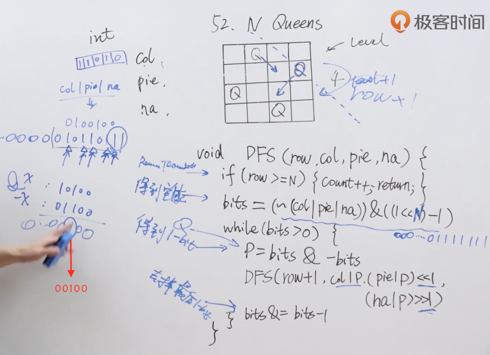

题目：n 皇后问题 研究的是如何将 n 个皇后放置在 n×n 的棋盘上，并且使皇后彼此之间不能相互攻击。

给你一个整数 n ，返回 n 皇后问题 不同的解决方案的数量。

示例1：


```shell
输入：n = 4
输出：2
解释：如上图所示，4 皇后问题存在两个不同的解法。
```

示例2：

```shell
输入：n = 1
输出：1
```

解题思路：使用位运算求解。



代码：

```java
class Solution {
    int count = 0;

    public int totalNQueens(int n) {
        if (n < 1) return 0;
        dfs(n, 0, 0, 0, 0);
        return count;
    }

    void dfs(int n, int row, int col, int pie, int na) {
        if (row >= n) {
            count += 1;
            return;
        }

      	//得到所有空位
        int bits = (~(col | pie | na)) & ((1 << n ) - 1);
        while (bits > 0) {
          	//获得一个空位
            int p = bits & -bits;
          	//进行递归
            dfs(n, row+1, col|p,(pie | p) << 1,(na | p) >> 1);
          	//去掉最后一位1
            bits &= bits-1;
        }
    }
}
```

