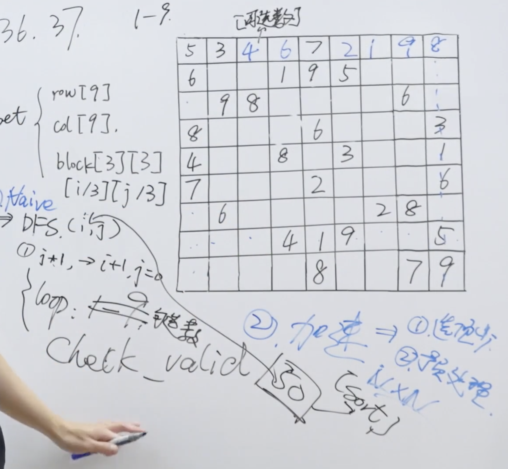

题目：编写一个程序，通过填充空格来解决数独问题。

数独的解法需 遵循如下规则：

数字 1-9 在每一行只能出现一次。
数字 1-9 在每一列只能出现一次。
数字 1-9 在每一个以粗实线分隔的 3x3 宫内只能出现一次。（请参考示例图）
数独部分空格内已填入了数字，空白格用 '.' 表示。

示例：


```shell
输入：board = [["5","3",".",".","7",".",".",".","."],["6",".",".","1","9","5",".",".","."],[".","9","8",".",".",".",".","6","."],["8",".",".",".","6",".",".",".","3"],["4",".",".","8",".","3",".",".","1"],["7",".",".",".","2",".",".",".","6"],[".","6",".",".",".",".","2","8","."],[".",".",".","4","1","9",".",".","5"],[".",".",".",".","8",".",".","7","9"]]
输出：[["5","3","4","6","7","8","9","1","2"],["6","7","2","1","9","5","3","4","8"],["1","9","8","3","4","2","5","6","7"],["8","5","9","7","6","1","4","2","3"],["4","2","6","8","5","3","7","9","1"],["7","1","3","9","2","4","8","5","6"],["9","6","1","5","3","7","2","8","4"],["2","8","7","4","1","9","6","3","5"],["3","4","5","2","8","6","1","7","9"]]
```

```shell
解释：输入的数独如上图所示，唯一有效的解决方案如下所示：
```


解题思路：依然是递归、剪枝、回溯。



代码：

```java
class Solution {
    public void solveSudoku(char[][] board) {
        if (board == null || board.length == 0) return;
        solve(board);
    }


    public boolean solve(char[][] board) {
        for (int i = 0 ; i<board.length;i++){
            for(int j = 0; j < board[0].length; j++) {
                if(board[i][j] == '.') {
                    for(char c = '1';c <= '9';c++) {
                        if(isValid(board,i,j,c)) {
                            board[i][j] = c;
                            if(solve(board))
                                return true;
                            else 
                                board[i][j] = '.';
                        }
                    }
                    return false;
                }
            }
        }
        return true;
    } 

    public boolean isValid(char[][] board, int row, int col, char c) {
        for (int i =0;i<9;i++) {
            if(board[i][col] !='.' && board[i][col] == c) return false;
            if(board[row][i] != '.' && board[row][i] == c) return false;
            if(board[3*(row/3) + i/3][3*(col/3) + i%3] != '.' &&  board[3*(row/3) + i/3][3*(col/3) + i%3] == c) return false;
        }
        return true;
    } 
}
```

