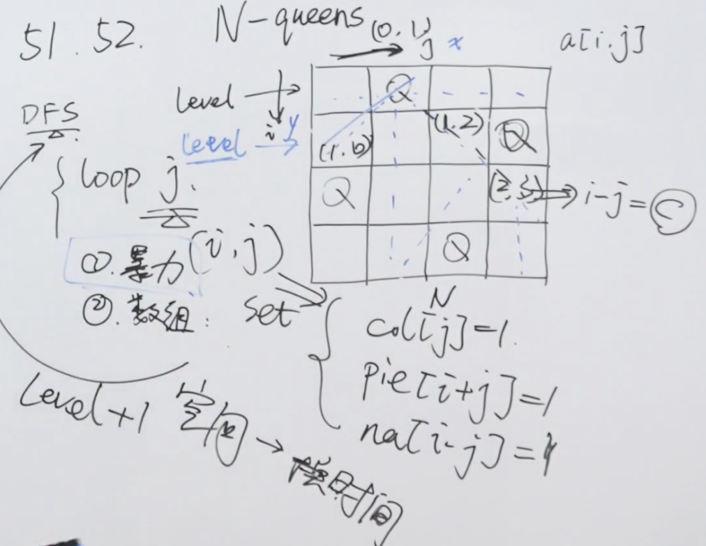

题目：n 皇后问题 研究的是如何将 n 个皇后放置在 n×n 的棋盘上，并且使皇后彼此之间不能相互攻击。

给你一个整数 n ，返回所有不同的 n 皇后问题 的解决方案。

每一种解法包含一个不同的 n 皇后问题 的棋子放置方案，该方案中 'Q' 和 '.' 分别代表了皇后和空位。

示例1：


```shell
输入：n = 4
输出：[[".Q..","...Q","Q...","..Q."],["..Q.","Q...","...Q",".Q.."]]
解释：如上图所示，4 皇后问题存在两个不同的解法。
```

示例2：

```shell
输入：n = 1
输出：[["Q"]]
```

解题思路：这道N皇后问题对我来说确实不好理解，还是参考官方代码进行理解，主要关注三个变量，一个是列，一个是撇，一个是捺，再对行进行遍历的时候同时关注这三个方向是否能够放置皇后。



代码：

```java
class Solution {
    public List<List<String>> solveNQueens(int n) {
        List<List<String>> solutions = new ArrayList<List<String>>();
        int[] queens = new int[n];
        Arrays.fill(queens, -1);
        Set<Integer> columns = new HashSet<Integer>();
        Set<Integer> diagonals1 = new HashSet<Integer>();
        Set<Integer> diagonals2 = new HashSet<Integer>();
        backtrack(solutions, queens, n, 0, columns, diagonals1, diagonals2);
        return solutions;
    }

    public void backtrack(List<List<String>> solutions, int[] queens, int n, int row, Set<Integer> columns, Set<Integer> diagonals1, Set<Integer> diagonals2) {
        if (row == n) {
            List<String> board = generateBoard(queens, n);
            solutions.add(board);
        } else {
            for (int i = 0; i < n; i++) {
                if (columns.contains(i)) {
                    continue;
                }
                int diagonal1 = row - i;
                if (diagonals1.contains(diagonal1)) {
                    continue;
                }
                int diagonal2 = row + i;
                if (diagonals2.contains(diagonal2)) {
                    continue;
                }
                queens[row] = i;
              	//列
                columns.add(i);
              	//撇
                diagonals1.add(diagonal1);
              	//捺
                diagonals2.add(diagonal2);
                backtrack(solutions, queens, n, row + 1, columns, diagonals1, diagonals2);
                queens[row] = -1;
              	//回溯进行还原
                columns.remove(i);
                diagonals1.remove(diagonal1);
                diagonals2.remove(diagonal2);
            }
        }
    }

    public List<String> generateBoard(int[] queens, int n) {
        List<String> board = new ArrayList<String>();
        for (int i = 0; i < n; i++) {
            char[] row = new char[n];
            Arrays.fill(row, '.');
            row[queens[i]] = 'Q';
            board.add(new String(row));
        }
        return board;
    }
}
```

