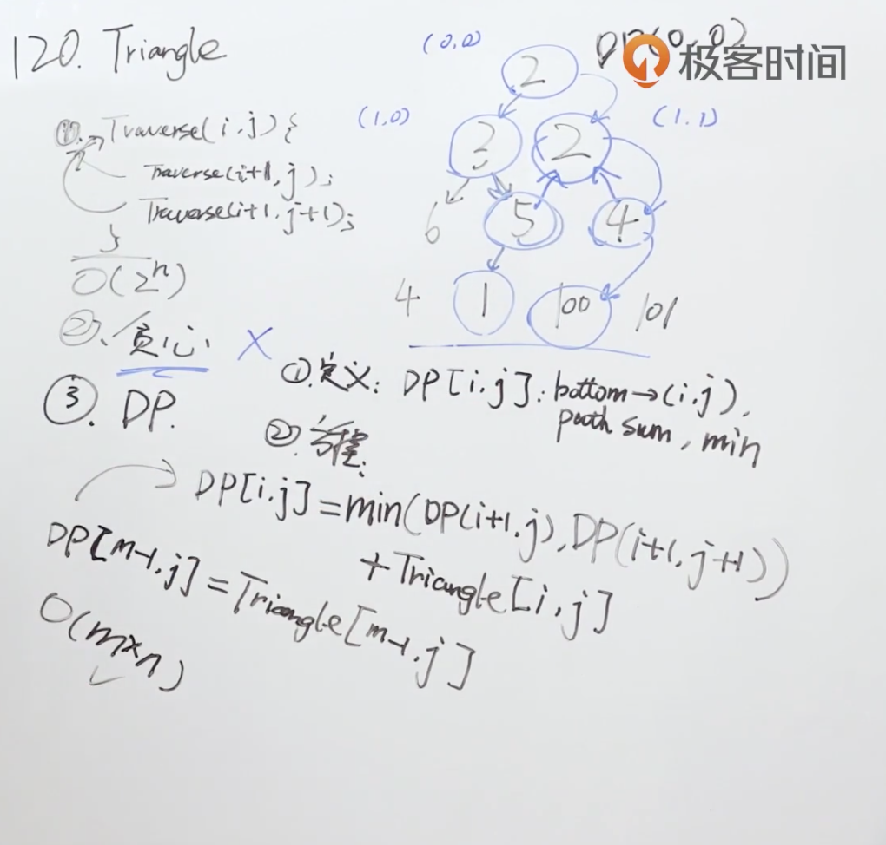

题目：给定一个三角形 triangle ，找出自顶向下的最小路径和。

每一步只能移动到下一行中相邻的结点上。相邻的结点 在这里指的是 下标 与 上一层结点下标 相同或者等于 上一层结点下标 + 1 的两个结点。也就是说，如果正位于当前行的下标 i ，那么下一步可以移动到下一行的下标 i 或 i + 1 。

示例1：

```shell
输入：triangle = [[2],[3,4],[6,5,7],[4,1,8,3]]
输出：11
解释：如下面简图所示：
   2
  3 4
 6 5 7
4 1 8 3
自顶向下的最小路径和为 11（即，2 + 3 + 5 + 1 = 11）。
```

示例2：

```shell
输入：triangle = [[-10]]
输出：-10
```

解题思路：寻找状态定义，归纳动态规划方程。



代码：

```java
class Solution {
    public int minimumTotal(List<List<Integer>> triangle) {
        if (triangle == null || triangle.size() == 0){
            return 0;
        }
        // 只需要记录每一层的最小值即可
        int[] dp = new int[triangle.size()+1];

        for (int i = triangle.size() - 1; i >= 0; i--) {
            List<Integer> curTr = triangle.get(i);
            for (int j = 0; j < curTr.size(); j++) {
                //这里的dp[j] 使用的时候默认是上一层的，赋值之后变成当前层
                dp[j] = Math.min(dp[j],dp[j+1]) + curTr.get(j);
            }
        }
        return dp[0];
    }
}
```

