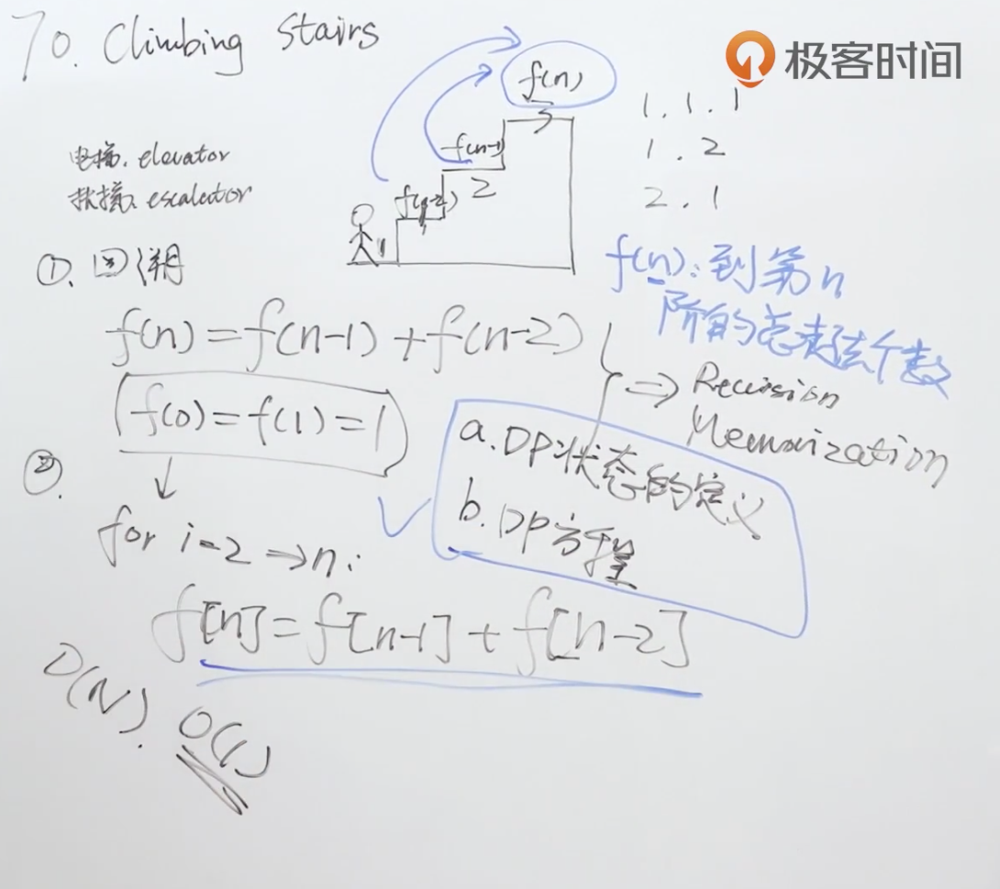

题目：假设你正在爬楼梯。需要 *n* 阶你才能到达楼顶。

每次你可以爬 1 或 2 个台阶。你有多少种不同的方法可以爬到楼顶呢？

**注意：** 给定 n 是一个正整数。

示例1：

```shell
输入： 2
输出： 2
解释： 有两种方法可以爬到楼顶。
1.  1 阶 + 1 阶
2.  2 阶
```

示例2：

```shell
输入： 3
输出： 3
解释： 有三种方法可以爬到楼顶。
1.  1 阶 + 1 阶 + 1 阶
2.  1 阶 + 2 阶
3.  2 阶 + 1 阶
```

解题思路：使用递推的方法找出dp方程，可以发现跟斐波那契数列一样，因此使用递推求解。

**第n个台阶只能从第n-1或者n-2个上来。到第n-1个台阶的走法 + 第n-2个台阶的走法 = 到第n个台阶的走法，已经知道了第1个和第2个台阶的走法，一路加上去。**



代码：

```java
class Solution {
    public int climbStairs(int n) {
        if (n <= 2) return n;
        int one_step_before = 2;
        int two_steps_before = 1;
      	//总的走法
        int all_ways = 0;

        for (int i = 2; i< n;i++) {
            //f(n) = f(n-1) + f(n-2)
            all_ways = one_step_before + two_steps_before;
            two_steps_before = one_step_before;
            one_step_before = all_ways;
        }
        return all_ways;
    }
}
```

