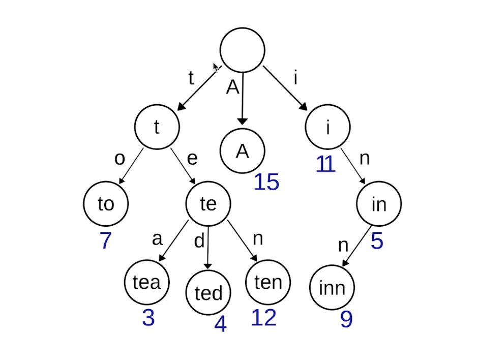

题目：Trie（发音类似 "try"）或者说 前缀树 是一种树形数据结构，用于高效地存储和检索字符串数据集中的键。这一数据结构有相当多的应用情景，例如自动补完和拼写检查。

请你实现 Trie 类：

Trie() 初始化前缀树对象。
void insert(String word) 向前缀树中插入字符串 word 。
boolean search(String word) 如果字符串 word 在前缀树中，返回 true（即，在检索之前已经插入）；否则，返回 false 。
boolean startsWith(String prefix) 如果之前已经插入的字符串 word 的前缀之一为 prefix ，返回 true ；否则，返回 false 。

示例：

```shell
输入
["Trie", "insert", "search", "search", "startsWith", "insert", "search"]
[[], ["apple"], ["apple"], ["app"], ["app"], ["app"], ["app"]]
输出
[null, null, true, false, true, null, true]

解释
Trie trie = new Trie();
trie.insert("apple");
trie.search("apple");   // 返回 True
trie.search("app");     // 返回 False
trie.startsWith("app"); // 返回 True
trie.insert("app");
trie.search("app");     // 返回 True
```

解题思路：



```java
class Trie {
    private TrieNode root;
    public Trie() {
        root = new TrieNode();
        root.val = ' ';
    }

    public void insert(String word) {
        TrieNode ws = root;
        for (int i = 0; i < word.length(); i++) {
            char c = word.charAt(i);
            //如果字符c不存在，就创建字符c的节点
            if (ws.children[c - 'a'] == null) {
                ws.children[c - 'a'] = new TrieNode(c);
            }
            ws = ws.children[c - 'a'];
        }
        //表示插入完成一个word
        ws.isWord = true;
    }

    public boolean search(String word) {
        TrieNode ws = root;
        for (int i = 0; i < word.length(); i++) {
            char c = word.charAt(i);
            //如果字符c不存在，返回false
            if (ws.children[c - 'a'] == null) return false;
            ws = ws.children[c - 'a'];
        }
        return ws.isWord;
    }

    public boolean startsWith(String prefix) {
        TrieNode ws = root;
        for (int i = 0; i < prefix.length(); i++) {
            char c = prefix.charAt(i);
            if (ws.children[c - 'a'] == null) return false;
            ws = ws.children[c - 'a'];
        }
        return true;
    }
}

/**
* 定义字典树的节点
**/
class TrieNode {
    //节点的值
    public char val;
    //是否是单词
    public boolean isWord;
    //孩子节点是26个小写字母的数组
    public TrieNode[] children = new TrieNode[26];

    public TrieNode() {
    }
    public TrieNode(char c) {
        TrieNode node = new TrieNode();
        node.val = c;
    }
}
```

