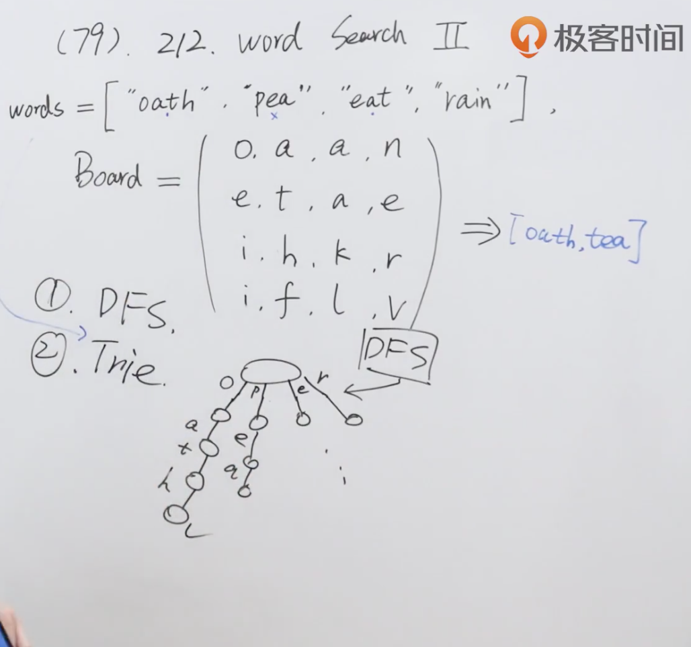

题目：给定一个 m x n 二维字符网格 board 和一个单词（字符串）列表 words，找出所有同时在二维网格和字典中出现的单词。

单词必须按照字母顺序，通过 相邻的单元格 内的字母构成，其中“相邻”单元格是那些水平相邻或垂直相邻的单元格。同一个单元格内的字母在一个单词中不允许被重复使用。

示例1：


```shell
输入：board = [["o","a","a","n"],["e","t","a","e"],["i","h","k","r"],["i","f","l","v"]], words = ["oath","pea","eat","rain"]
输出：["eat","oath"]
```

示例2：


```shell
输入：board = [["a","b"],["c","d"]], words = ["abcb"]
输出：[]
```

解题思路：使用字典树存放需要查找的字符串的结果，然后对二维数组board进行递归查找所有的结果。



```java
class Solution {
    //结果set，防止重复
    Set<String> res = new HashSet<>();

    public List<String> findWords(char[][] board, String[] words) {
        Trie trie = new Trie();
      	//将所有需要查找的结果存放入字典树中
        for (String word : words) {
            trie.insert(word);
        }
      	//m,n记录二维数组的高度、宽度
        int m = board.length;
        int n = board[0].length;
      	//用来记录所有被访问过的元素
        boolean[][] visited = new boolean[m][n];
      	//对二维数组进行遍历
        for (int i = 0; i < m; i++) {
            for (int j = 0; j < n; j++) {
                dfs(board,visited,"",i,j,trie);
            }
        }
        return new ArrayList<String>(res);
    }


    void dfs(char[][] board, boolean[][] visited, String str, int x, int y, Trie trie) {
      	//如果x越界，或者y越界直接return
        if (x <0 || x >= board.length || y < 0 || y>= board[0].length) return;
      	//如果被访问过，直接return
        if (visited[x][y]) return;

      	//拼接结果
        str += board[x][y];
      	//如果不是以字符串开头直接return
        if (!trie.startsWith(str)) return;

      	//如果找到字符串添加入结果
        if (trie.search(str)) {
            res.add(str);
        }

      	//将添加过的元素标记为访问过
        visited[x][y] = true;
      	//对二维数组进行x,y方向的递归
        dfs(board,visited,str,x-1,y,trie);
        dfs(board,visited,str,x+1,y,trie);
        dfs(board,visited,str,x,y-1,trie);
        dfs(board,visited,str,x,y+1,trie);
      	//恢复为未访问
        visited[x][y] = false;
    }
}

class Trie {
    private TrieNode root;
    public Trie() {
        root = new TrieNode();
        root.val = ' ';
    }

    public void insert(String word) {
        TrieNode ws = root;
        for (int i = 0; i < word.length(); i++) {
            char c = word.charAt(i);
            if (ws.children[c - 'a'] == null) {
                ws.children[c - 'a'] = new TrieNode(c);
            }
            ws = ws.children[c - 'a'];
        }
        ws.isWord = true;
    }

    public boolean search(String word) {
        TrieNode ws = root;
        for (int i = 0; i < word.length(); i++) {
            char c = word.charAt(i);
            if (ws.children[c - 'a'] == null) return false;
            ws = ws.children[c - 'a'];
        }
        return ws.isWord;
    }

    public boolean startsWith(String prefix) {
        TrieNode ws = root;
        for (int i = 0; i < prefix.length(); i++) {
            char c = prefix.charAt(i);
            if (ws.children[c - 'a'] == null) return false;
            ws = ws.children[c - 'a'];
        }
        return true;
    }
}

class TrieNode {
    public char val;
    public boolean isWord;
    public TrieNode[] children = new TrieNode[26];

    public TrieNode() {
    }
    public TrieNode(char c) {
        TrieNode node = new TrieNode();
        node.val = c;
    }
}
```

