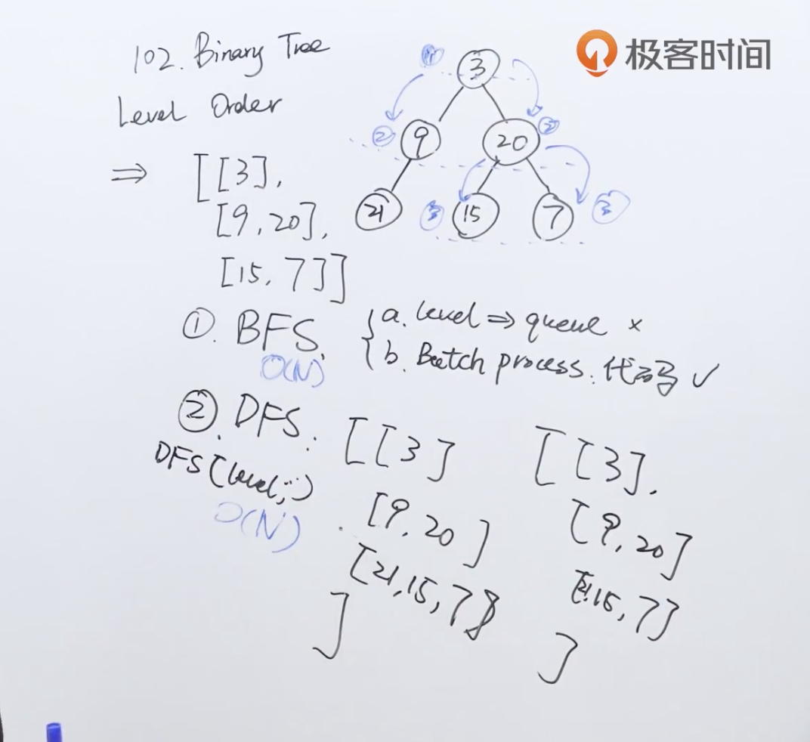

题目：给你一个二叉树，请你返回其按 **层序遍历** 得到的节点值。 （即逐层地，从左到右访问所有节点）。

示例：

二叉树：`[3,9,20,null,null,15,7]`,

```shell
    3
   / \
  9  20
    /  \
   15   7
```

返回其层序遍历结果：

```shell
[
  [3],
  [9,20],
  [15,7]
]
```

解题思路：一是BFS，广度优先搜索，即从根节点开始，将每一层的元素都访问一遍；二是DFS，深度优先搜索，后面做到深度优先搜索的题目再回头看。


代码：

解法一：

```java
/**
 * Definition for a binary tree node.
 * public class TreeNode {
 *     int val;
 *     TreeNode left;
 *     TreeNode right;
 *     TreeNode() {}
 *     TreeNode(int val) { this.val = val; }
 *     TreeNode(int val, TreeNode left, TreeNode right) {
 *         this.val = val;
 *         this.left = left;
 *         this.right = right;
 *     }
 * }
 */
class LevelOrder {
    public List<List<Integer>> levelOrder(TreeNode root) {
        //结果数组
        ArrayList<List<Integer>> res = new ArrayList<>();
        if (root == null) return res;

        //用LinkedList实现队列
        Queue<TreeNode> q = new LinkedList<>();
        //用于存放下一级的节点
        q.add(root);

        while (!q.isEmpty()) {
            //根据队列中存放的元素的个数来判断下面循环的次数
            int levelSize = q.size();
            //每次循环建立一个新的数组，用于存放当前层的元素
            ArrayList<Integer> currLevel = new ArrayList<>();

            for (int i = 0; i < levelSize; i++) {
                TreeNode currNode = q.poll();
                //将队列中的节点加入到本层的数组中
                currLevel.add(currNode.val);
                //如果节点的左孩子不为空，就加入到队列中，用于下一次循环
                if (currNode.left != null) {
                    q.add(currNode.left);
                }
              	//如果节点的右孩子不为空，就加入到队列中，用于下一次循环
                if (currNode.right != null) {
                    q.add(currNode.right);
                }
            }
            res.add(currLevel);
        }
        return res;
    }
}
```

