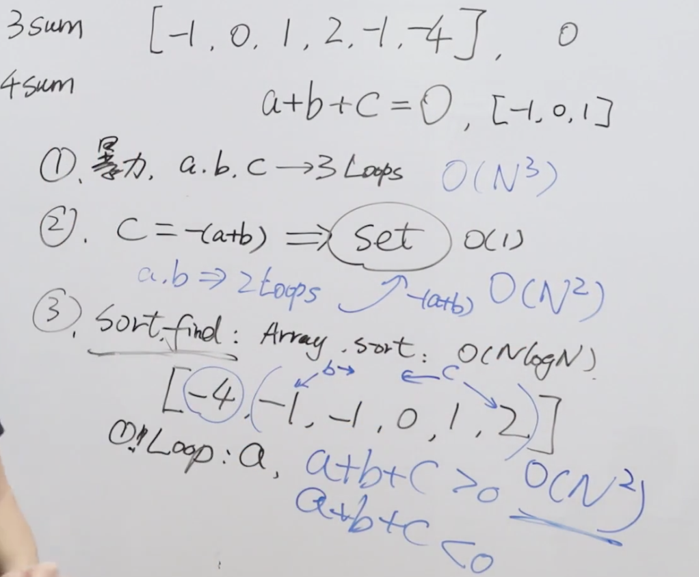

题目：给你一个包含 n 个整数的数组 nums，判断 nums 中是否存在三个元素 a，b，c ，使得 a + b + c = 0 ？请你找出所有和为 0 且不重复的三元组。

注意：答案中不可以包含重复的三元组。

示例1：

```shell
输入：nums = [-1,0,1,2,-1,-4]
输出：[[-1,-1,2],[-1,0,1]]
```

示例2：

```shell
输入：nums = [0]
输出：[]
```

解题思路：本题是两数之和的加强版，第一时间想到的还是暴力三次嵌套循环，很显然时间复杂度N的三次方，提交直接超时，这个必然不是最优解，于是想到和两数之和第二个解法的套路，用map存下所有的数组元素，仍然使用两次嵌套循环，然后在map中查找-(a+b)，如果找到，就将它们组成需要返回的结果数组，这样的时间复杂度是N的平方。



代码：

```java
class ThreeSum {

    public List<List<Integer>> threeSum(int[] nums) {
        //使用map存储数组所有元素
        HashMap<Integer, Integer> hashMap = new HashMap<>();
        for (int i = 0; i < nums.length; i++) {
            hashMap.put(nums[i], i);
        }
        //创建一个结果的set，这样保证没有重复的List
        Set<List<Integer>> hashSet = new HashSet<>();
        //两层循环
        for (int i = 0; i < nums.length; i++) {
            for (int j = i + 1; j < nums.length; j++) {
                //判断map中是否有-(a+b)，并且元素不能重复使用
                if (hashMap.containsKey(-(nums[i] + nums[j])) && (i != hashMap.get(-(nums[i] + nums[j]))) && (j != hashMap.get(-(nums[i] + nums[j])))) {
                    List<Integer> arrayList = new ArrayList<>();
                    arrayList.add(-(nums[i] + nums[j]));
                    arrayList.add(nums[i]);
                    arrayList.add(nums[j]);
                    //对每一个结果进行排序，保证放入set的没有重复的解法
                    Collections.sort(arrayList);
                    hashSet.add(arrayList);
                }
            }
        }
        return new ArrayList<>(hashSet);
    }
}
```

