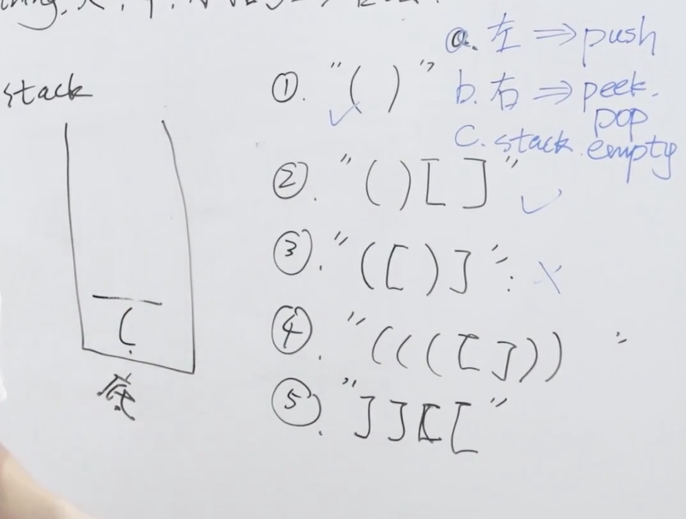

题目：给定一个只包括 '('，')'，'{'，'}'，'['，']' 的字符串 s ，判断字符串是否有效。

有效字符串需满足：

左括号必须用相同类型的右括号闭合。
左括号必须以正确的顺序闭合。

示例1：

```shell
输入：s = "()"
输出：true
```

示例2：

```shell
输入：s = "()[]{}"
输出：true
```

示例3：

```shell
输入：s = "([)]"
输出：false
```

示例4：

```shell
输入：s = "{[]}"
输出：true
```

解题思路：本题是一道典型的使用栈解决的问题，规则如下，当遇到左括号时，就push入栈；当遇到右括号时查看和栈顶元素是否匹配，如果匹配，则栈顶元素出栈；最后返回空栈。



代码：

```java
class Solution {
    public static boolean isValid(String s) {
        //栈用于存放字典map中没有的元素
        Stack<Character> stack = new Stack<>();
        //字段map
        HashMap<Object, Object> hashMap = new HashMap<>();
        hashMap.put(')', '(');
        hashMap.put('}', '{');
        hashMap.put(']', '[');
        //遍历字符串每个字符
        for (int i = 0; i < s.length(); i++) {
            //如果字典map中没有的元素，就Push进栈
            if (hashMap.get(s.charAt(i)) == null) {
                stack.push(s.charAt(i));
                //当栈不为空或者字典map中获得的元素和栈顶元素不匹配时返回false
            } else if (stack.isEmpty() || hashMap.get(s.charAt(i)) != stack.pop()) {
                return false;
            }
        }
        return stack.isEmpty();
    }
}
```

