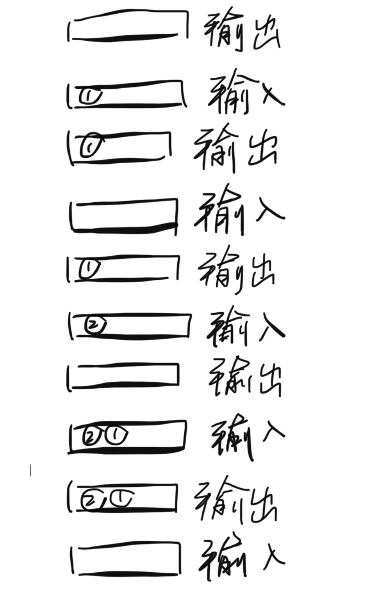

题目：请你仅使用两个队列实现一个后入先出（LIFO）的栈，并支持普通队列的全部四种操作（push、top、pop 和 empty）。

实现 MyStack 类：

- void push(int x) 将元素 x 压入栈顶。
- int pop() 移除并返回栈顶元素。
- int top() 返回栈顶元素。
- boolean empty() 如果栈是空的，返回 true ；否则，返回 false 。

示例：

```shell
输入：
["MyStack", "push", "push", "top", "pop", "empty"]
[[], [1], [2], [], [], []]
输出：
[null, null, null, 2, 2, false]

解释：
MyStack myStack = new MyStack();
myStack.push(1);
myStack.push(2);
myStack.top(); // 返回 2
myStack.pop(); // 返回 2
myStack.empty(); // 返回 False
```

解题思路：使用两个队列，一个为输入队列，一个为输出队列，当入栈操作时，我们先将输出队列内容导入输入队列，然后将入栈元素放入输出队列队头位置，再将输入队列内容，依次添加进输出队列即可。



代码：

```java
class MyStack {
    private Queue<Integer> input;//输入队列
    private Queue<Integer> output;//输出队列

    public MyStack() {
        input = new LinkedList<>();
        output = new LinkedList<>();
    }

    public void push(int x) {
        input.offer(x);
        // 将输出队列中元素全部转给输入队列
        while(!output.isEmpty())
            input.offer(output.poll());
        // 使用临时队列记录输入队列的元素
        Queue temp = input;
        // 交换输入队列和输出队列,使得输入队列没有在push()的时候始终为空队列
        input = output;
        // 将临时队列赋给输出队列，栈pop的时候使用输出队列进行出栈
        output = temp;
    }

    public int pop() {
        return output.poll();
    }

    public int top() {
        return output.peek();
    }

    public boolean empty() {
        return output.isEmpty();
    }
}
```

