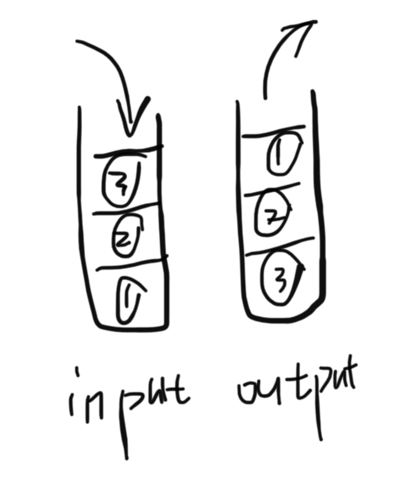

题目：请你仅使用两个栈实现先入先出队列。队列应当支持一般队列支持的所有操作（push、pop、peek、empty）：

实现 MyQueue 类：

- void push(int x) 将元素 x 推到队列的末尾
- int pop() 从队列的开头移除并返回元素
- int peek() 返回队列开头的元素
- boolean empty() 如果队列为空，返回 true ；否则，返回 false

示例：

```shell
输入：
["MyQueue", "push", "push", "peek", "pop", "empty"]
[[], [1], [2], [], [], []]
输出：
[null, null, null, 1, 1, false]

解释：
MyQueue myQueue = new MyQueue();
myQueue.push(1); // queue is: [1]
myQueue.push(2); // queue is: [1, 2] (leftmost is front of the queue)
myQueue.peek(); // return 1
myQueue.pop(); // return 1, queue is [2]
myQueue.empty(); // return false
```

解题思路：使用两个栈，一个为输入栈，一个为输出栈，所有push的操作在input输入栈操作，所有peek、pop的操作在output输出栈操作，所有输入栈的元素进入输出栈颠倒一下顺序。



代码：

```java
class MyQueue {

  	//输入栈
    Stack<Integer> input = null;
  	//输出栈
    Stack<Integer> output = null;

    /** Initialize your data structure here. */
    public MyQueue() {
        input = new Stack<>();
        output = new Stack<>();
    }
    
    /** Push element x to the back of queue. */
    public void push(int x) {
        input.push(x);
    }
    
    /** Removes the element from in front of queue and returns that element. */
    public int pop() {
        if (output.isEmpty()) {
            while (!input.isEmpty()){
                output.push(input.pop());
            }
        }
        return output.pop();
    }
    
    /** Get the front element. */
    public int peek() {
        if (output.isEmpty()) {
            while (!input.isEmpty()){
                output.push(input.pop());
            }
        }
        return output.peek();
    }
    
    /** Returns whether the queue is empty. */
    public boolean empty() {
        return output.isEmpty() && input.isEmpty();
    }
}
```

