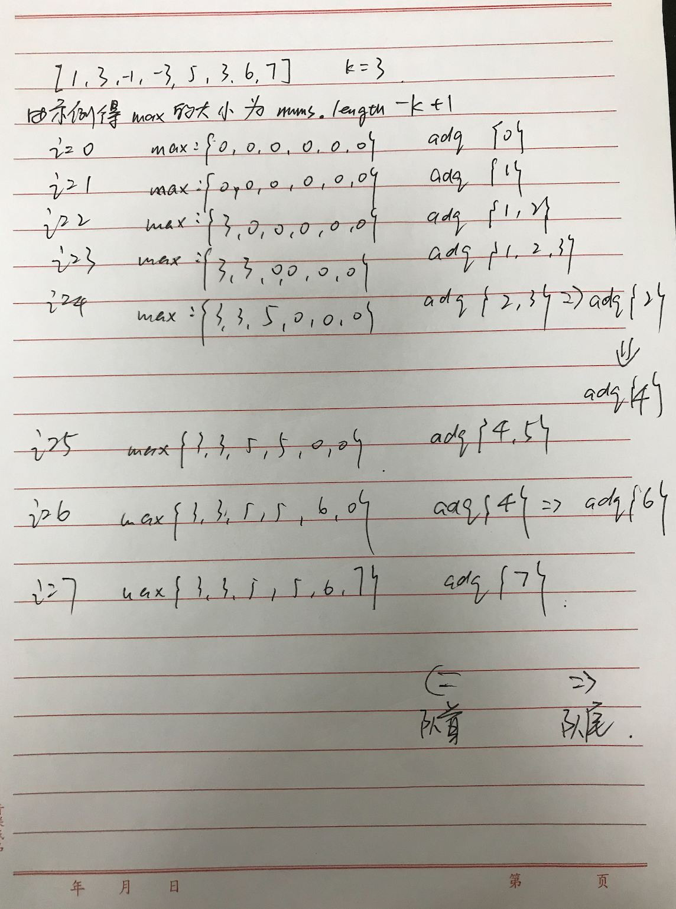

题目：给你一个整数数组 nums，有一个大小为 k 的滑动窗口从数组的最左侧移动到数组的最右侧。你只可以看到在滑动窗口内的 k 个数字。滑动窗口每次只向右移动一位。

返回滑动窗口中的最大值。

示例：

```shell
输入：nums = [1,3,-1,-3,5,3,6,7], k = 3
输出：[3,3,5,5,6,7]
解释：
滑动窗口的位置                最大值
---------------               -----
[1  3  -1] -3  5  3  6  7       3
 1 [3  -1  -3] 5  3  6  7       3
 1  3 [-1  -3  5] 3  6  7       5
 1  3  -1 [-3  5  3] 6  7       5
 1  3  -1  -3 [5  3  6] 7       6
 1  3  -1  -3  5 [3  6  7]      7
```

解题思路：我们用双向队列，在遇到新的数的时候，将新的数和双向队列的末尾进行比较，如果末尾的数比新数小，则把末尾的数扔掉，直到该队列的末尾数比新数大或者队列为空的时候才停止。这样，我们可以保证队列（队列保存元素下标）里的元素是降序排列的。由于队列中只有窗口里的数，就是窗口里的第一大数，第二大数，第三数…...

如何保持队列呢。每当滑动窗口的k已满，想要新进来一个数，就需要把滑动窗口最左边的数移出队列，添加新的数。

我们在添加新的数的时候，就已经移出了一些数，这样队列头部的数不一定是窗口最左边的数。技巧：我们队列中只存储那个数在原数组的下标。这样可以判断该数是否为最滑动窗口的最左边的数。



代码：

```java
class MaxHeap {

    public int[] maxSlidingWindow(int[] nums, int k) {
        if (!(nums instanceof int[]) || nums == null || nums.length == 0)//判断传进来的是否为int数组，int数组是否为空，int数组是否没有数据
            return new int[0];
        ArrayDeque<Integer> adq = new ArrayDeque<Integer>(k);
        int[] max = new int[nums.length + 1 - k];//获得该nums数组滑动窗口的个数
        for (int i = 0; i < nums.length; i++) {
            //每当滑动窗口的k已满，想要新进来一个数，就需要把滑动窗口最左边的数移出队列，添加新的数
            if (!adq.isEmpty() && adq.peekFirst() == i - k)
                adq.removeFirst();
            //把队列尾部的数和新数一一比较，比新数小的都移出队列，直到该队列的末尾数比新数大或者队列为空的时候才停止，保证队列是降序的
            while (!adq.isEmpty() && nums[adq.peekLast()] < nums[i])
                adq.removeLast();
            //从尾部加入新的数
            adq.offerLast(i);
            //队列头部就是该窗口最大的数
            if (i >= k - 1)//i < k - 1时，滑动窗口才有最大值
                max[i + 1 - k] = nums[adq.peek()];
        }
        return max;
    }
}
```

