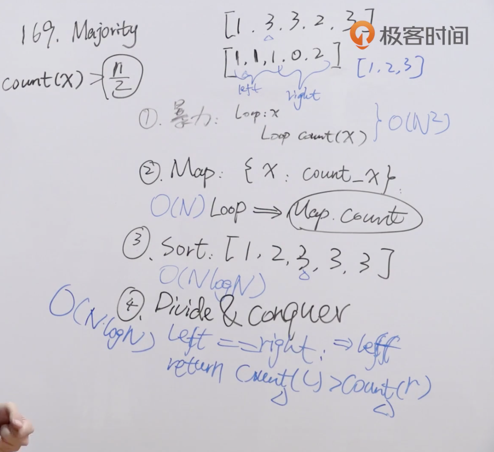

题目：给定一个大小为 n 的数组，找到其中的多数元素。多数元素是指在数组中出现次数 大于 ⌊ n/2 ⌋ 的元素。

你可以假设数组是非空的，并且给定的数组总是存在多数元素。

示例1：

```shell
输入：[3,2,3]
输出：3
```

示例2：

```shell
输入：[2,2,1,1,1,2,2]
输出：2
```

解题思路：本题有多种解法，首先想到的是利用map进行元素次数统计，然后返回次数最多的元素；然后是使用分治的思想，将数组一分为二，找出分开的数组中出现次数最多的元素，再和另外分开的数组出现次数最多的元素进行比较，返回出现次数最多的元素。



代码：

解法一：

```java
import java.util.*;
class Solution {
    public int majorityElement(int[] nums) {
        HashMap<Integer, Integer> hashMap = new HashMap<>();

      	//首先将数组所有元素进行统计次数，放入map中
        for (int i = 0; i < nums.length; i++) {
            Integer num = hashMap.get(nums[i]);
            if (num == null) {
                hashMap.put(nums[i], 1);
            } else {
                hashMap.put(nums[i], num + 1);
            }
        }

      	//对map进行取最大的value，即找出最多次数
        Collection<Integer> c = hashMap.values();
        Object[] obj = c.toArray();
        Arrays.sort(obj);
      	//排序过后的数组的最后一个元素即是最大的value
        Object o = obj[obj.length - 1];
      
      	//返回map中value是最大值的元素
        for (int i = 0; i < nums.length; i++) {
            if (hashMap.get(nums[i]) == (Integer) o) {
                return nums[i];
            }
        }
        return 0;
    }
}
```

解法二：参考leetcode上的摩尔投票法，从第一个数开始，遇到相同的就+1，不同的就-1，结果为0时换为当前数继续，直到数组遍历结束。

```java
class Solution {
    public int majorityElement(int[] nums) {
        int res = nums[0];
        int times = 0;

        for (int i = 0; i < nums.length; i++) {
            if (nums[i] == res) {
                times++;
            } else if (times == 0) {
                res = nums[i];
            } else {
                times --;
            }
        }
        return res;
    }
}
```

