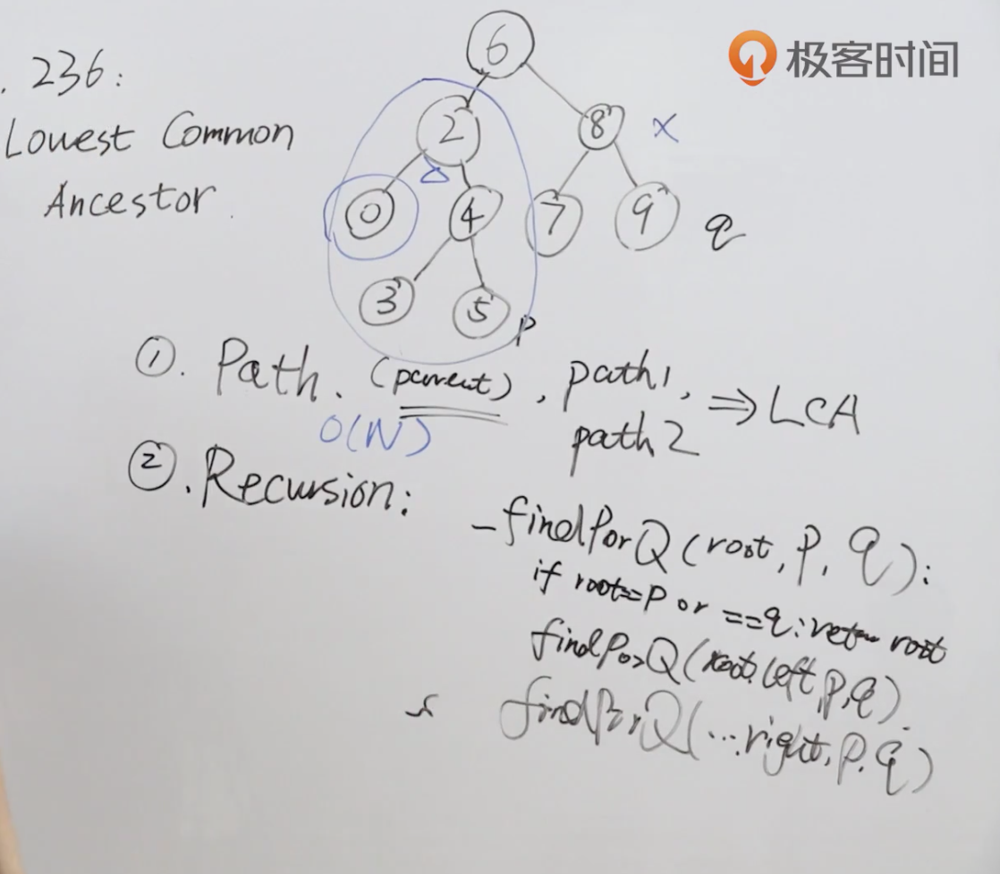

题目：给定一个二叉树, 找到该树中两个指定节点的最近公共祖先。

百度百科中最近公共祖先的定义为：“对于有根树 T 的两个节点 p、q，最近公共祖先表示为一个节点 x，满足 x 是 p、q 的祖先且 x 的深度尽可能大（一个节点也可以是它自己的祖先）。”

示例：


```shell
输入：root = [3,5,1,6,2,0,8,null,null,7,4], p = 5, q = 1
输出：3
解释：节点 5 和节点 1 的最近公共祖先是节点 3 。
```

解题思路：使用递归法，对二叉树的左右子树分别进行遍历。



代码：

```java
/**
 * Definition for a binary tree node.
 * public class TreeNode {
 *     int val;
 *     TreeNode left;
 *     TreeNode right;
 *     TreeNode(int x) { val = x; }
 * }
 */
class Solution {
    public TreeNode lowestCommonAncestor(TreeNode root, TreeNode p, TreeNode q) {
      	//当遍历到叶结点后就会返回null
      	//当找到p或者q的是时候就会返回pq
        if(root == null || root == p || root == q) return root;
      	//对左子树进行遍历，找到p或者q就返回该节点
        TreeNode left = lowestCommonAncestor(root.left,p,q);
      	//对右子树进行遍历，找到p或者q就返回该节点
        TreeNode right = lowestCommonAncestor(root.right,p,q);
      	//如果左子树没有找到p或q就返回右子树的节点；如果右子树没找到p或q就返回左子树的节点；如果左右子树都没有找到p或q，就返回父节点
        return left == null ? right : right == null ? left : root;
    }
}
```


