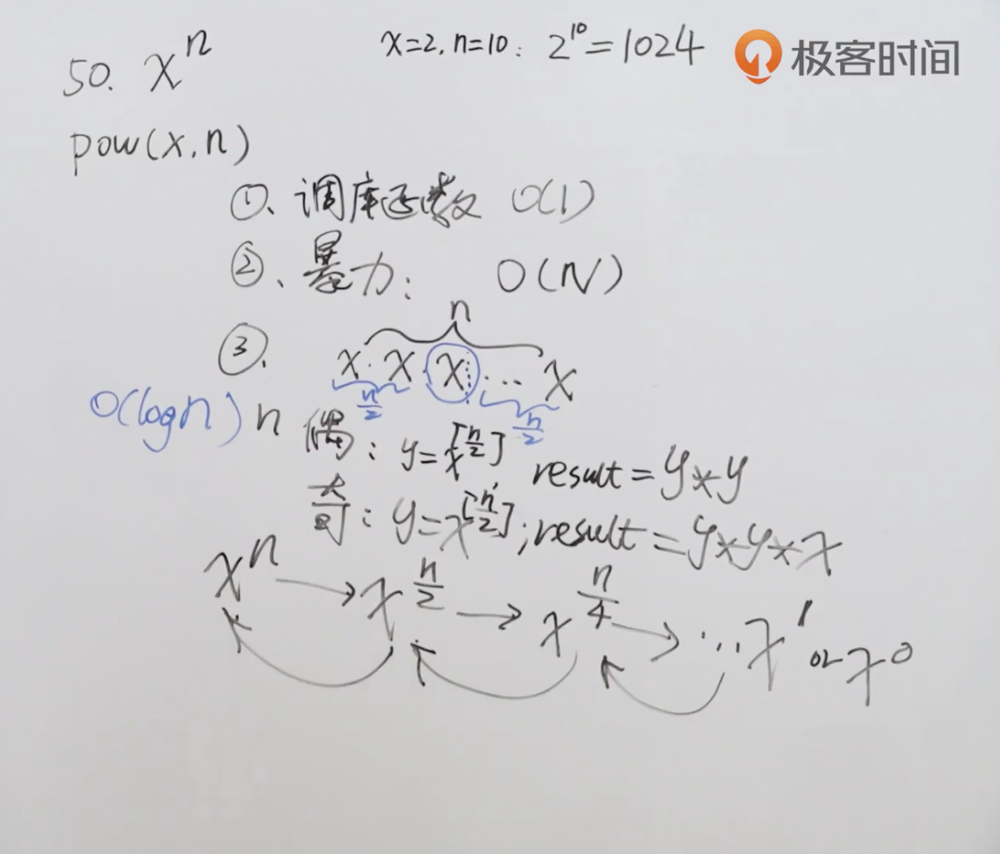

题目：实现 [pow(*x*, *n*)](https://www.cplusplus.com/reference/valarray/pow/) ，即计算 x 的 n 次幂函数（即，x的n次幂）。

示例1：

```shell
输入：x = 2.00000, n = 10
输出：1024.00000
```

示例2：

```shell
输入：x = 2.10000, n = 3
输出：9.26100
```

解题思路：使用分治的思想，将问题一分为二，每个子问题还是递归地进行解决。



代码：

```java
class Solution {
    public double myPow(double x, int n) {
      	//如果n为0，直接返回1
        if (n == 0) return 1;
      	//如果n小于0，返回对数的结果
        if (n < 0) return 1 / myPow(x, -n);
      	//如果n是奇数
        if (n % 2 != 0) return x * myPow(x, n-1);
      	//如果n是偶数，如上图，两个x的二分之n次幂相乘
        return myPow(x*x, n/2);
    }
}
```

