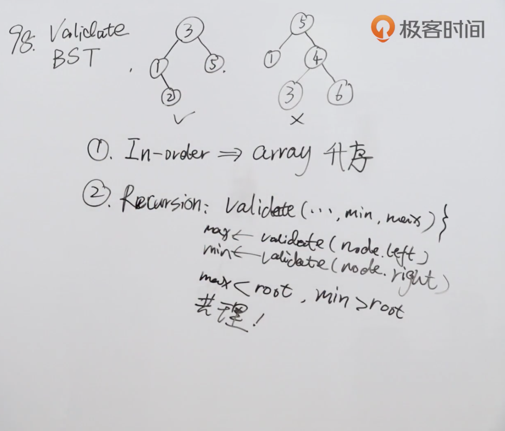

题目：给定一个二叉树，判断其是否是一个有效的二叉搜索树。

假设一个二叉搜索树具有如下特征：

节点的左子树只包含小于当前节点的数。
节点的右子树只包含大于当前节点的数。
所有左子树和右子树自身必须也是二叉搜索树。

示例：

```shell
输入:
    5
   / \
  1   4
     / \
    3   6
输出: false
解释: 输入为: [5,1,4,null,null,3,6]。
     根节点的值为 5 ，但是其右子节点值为 4 。
```

解题思路：一种是中序遍历，这种方法目前不太熟悉；二是使用递归，只需要关注本层递归做什么。



代码：

解法一：

```java
/**
 * Definition for a binary tree node.
 * public class TreeNode {
 *     int val;
 *     TreeNode left;
 *     TreeNode right;
 *     TreeNode() {}
 *     TreeNode(int val) { this.val = val; }
 *     TreeNode(int val, TreeNode left, TreeNode right) {
 *         this.val = val;
 *         this.left = left;
 *         this.right = right;
 *     }
 * }
 */
class Solution {
    public boolean isValidBST(TreeNode root) {
        return isValid(root, Long.MIN_VALUE, Long.MAX_VALUE);
    }

    public boolean isValid(TreeNode root, long min, long max) {
        //空树是二叉搜索树
        if(root == null) return true;
        if(min >= root.val) return false;
        if(max <= root.val) return false;
        
        //遍历左子树时，左子树所有节点都应该小于父节点，更新上界max为父节点
        //遍历右子树时，右子树所有节点都应该大于父节点，更新下界min为父节点
        return isValid(root.left,min,root.val) && isValid(root.right,root.val,max);
    }
}
```


