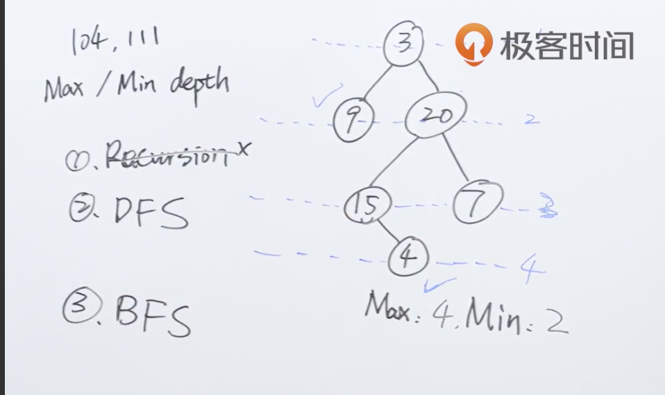
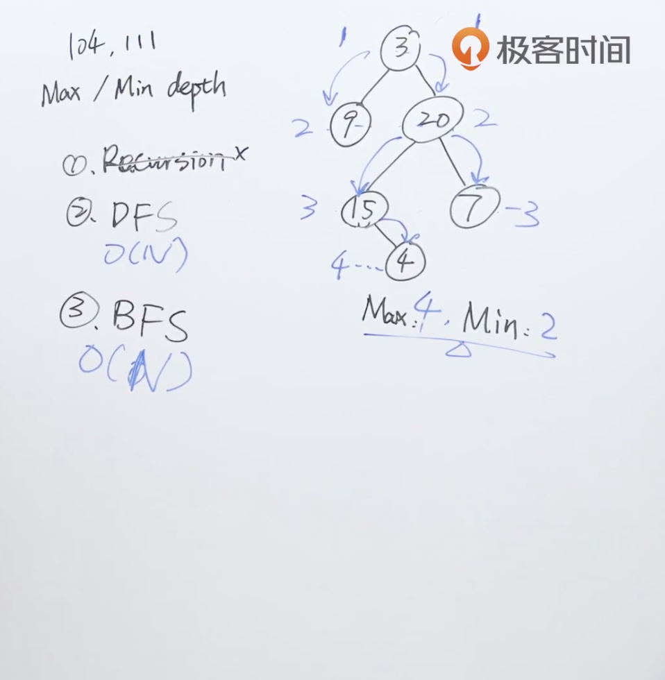

题目：给定一个二叉树，找出其最大深度。

二叉树的深度为根节点到最远叶子节点的最长路径上的节点数。

**说明:** 叶子节点是指没有子节点的节点。

示例：

给定二叉树 `[3,9,20,null,null,15,7]`，

```shell
    3
   / \
  9  20
    /  \
   15   7
```

返回它的最大深度 3 。

解题思路：这题和111题最小深度一样，字面意思上应该使用深度优先算法，但是广度优先算法更符合人的思维，因此这边先套用广度优先算法的模板求解。



代码：

解法一：广度优先算法很好理解，因为广度优先算法会将所有节点全部走一遍，因此在每层循环的时候，将深度的值+1即可。

```java
/**
 * Definition for a binary tree node.
 * public class TreeNode {
 *     int val;
 *     TreeNode left;
 *     TreeNode right;
 *     TreeNode() {}
 *     TreeNode(int val) { this.val = val; }
 *     TreeNode(int val, TreeNode left, TreeNode right) {
 *         this.val = val;
 *         this.left = left;
 *         this.right = right;
 *     }
 * }
 */
class Solution {
    public int maxDepth(TreeNode root) {
        int depth = 0;
        if (root == null) return 0;

        Queue<TreeNode> q = new LinkedList<>();
        q.add(root);

        while (!q.isEmpty()) {
            int levelSize = q.size();

            for (int i = 0; i < levelSize; i++) {
                TreeNode currNode = q.poll();
                if (currNode.left != null) {
                    q.add(currNode.left);
                }
                if (currNode.right != null) {
                    q.add(currNode.right);
                }
            }
          	//在循环体中每次将深度+1
            depth++;
        }
        return depth;
    }
}
```

解法二：使用分治的方法，分别求得左右子树的最大深度，然后去一个最大值。



```java
/**
 * Definition for a binary tree node.
 * public class TreeNode {
 *     int val;
 *     TreeNode left;
 *     TreeNode right;
 *     TreeNode() {}
 *     TreeNode(int val) { this.val = val; }
 *     TreeNode(int val, TreeNode left, TreeNode right) {
 *         this.val = val;
 *         this.left = left;
 *         this.right = right;
 *     }
 * }
 */
class Solution {
    public int maxDepth(TreeNode root) {
      	//对左右子树的最大深度求最大值
        return root == null ? 0 : 1 + Math.max(maxDepth(root.left),maxDepth(root.right));
    }
}
```

