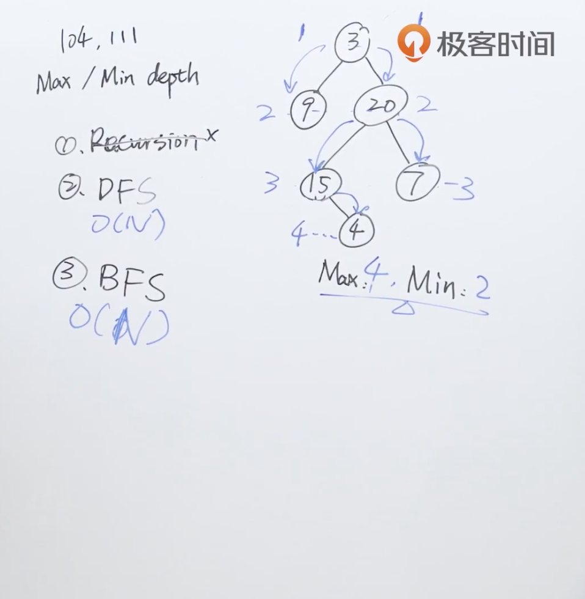

题目：给定一个二叉树，找出其最小深度。

最小深度是从根节点到最近叶子节点的最短路径上的节点数量。

**说明：**叶子节点是指没有子节点的节点。

示例1：


```shell
输入：root = [3,9,20,null,null,15,7]
输出：2
```

解题思路：同104题最大深度，先使用广度优先算法求解，再使用深度优先算法。


代码：

解法一：

```java
/**
 * Definition for a binary tree node.
 * public class TreeNode {
 *     int val;
 *     TreeNode left;
 *     TreeNode right;
 *     TreeNode() {}
 *     TreeNode(int val) { this.val = val; }
 *     TreeNode(int val, TreeNode left, TreeNode right) {
 *         this.val = val;
 *         this.left = left;
 *         this.right = right;
 *     }
 * }
 */
class Solution {
    public int minDepth(TreeNode root) {
      	//初始值为1是因为本层也需要计算一次深度
        int depth = 1;
        if (root == null) return 0;

        Queue<TreeNode> q = new LinkedList<>();
        q.add(root);

        while (!q.isEmpty()) {
            int levelSize = q.size();

            for (int i = 0; i < levelSize; i++) {
                TreeNode currNode = q.poll();
                if (currNode.left != null) {
                    q.add(currNode.left);
                }
                if (currNode.right != null) {
                    q.add(currNode.right);
                }
              	//当左右孩子都为空时，直接返回当前深度
                if (currNode.right == null && currNode.left == null) {
                    return depth;
                }
            }
            depth++;
        }
        return depth;
    }
}
```

解法二：使用分治的方法，分别求左右子树的最小深度，然后取最小值。



```java
/**
 * Definition for a binary tree node.
 * public class TreeNode {
 *     int val;
 *     TreeNode left;
 *     TreeNode right;
 *     TreeNode() {}
 *     TreeNode(int val) { this.val = val; }
 *     TreeNode(int val, TreeNode left, TreeNode right) {
 *         this.val = val;
 *         this.left = left;
 *         this.right = right;
 *     }
 * }
 */
class Solution {
    public int minDepth(TreeNode root) {
        if(root == null ) return 0;
      	//分别求左右子树的最小深度
        int minLeft = minDepth(root.left);
        int minRigtht = minDepth(root.right);
      	//返回左右子树的最小深度
        return (minLeft == 0 || minRigtht == 0) ?
            minLeft + minRigtht + 1 : Math.min(minLeft,minRigtht) + 1;
    }
}
```

