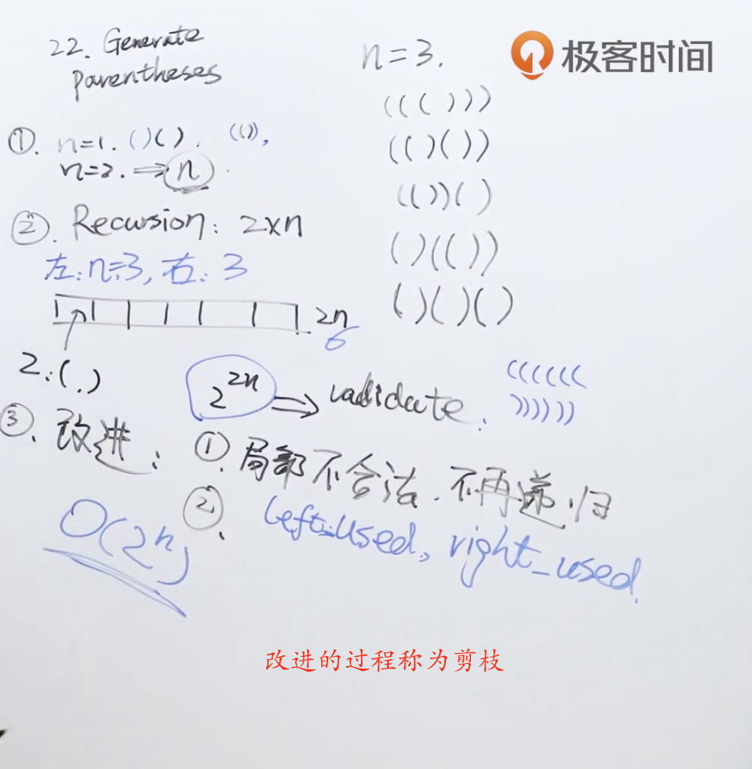

题目：数字 `n` 代表生成括号的对数，请你设计一个函数，用于能够生成所有可能的并且 **有效的** 括号组合。

示例1：

```shell
输入：n = 3
输出：["((()))","(()())","(())()","()(())","()()()"]
```

示例2：

```shell
输入：n = 1
输出：["()"]
```

解题思路：此题使用递归进行求解，因为左右括号的总个数是2n个，所以分开来看左右括号满足什么样的条件进行拼接。



代码：

```java
class Solution {
    List<String> list = new ArrayList<>();

    public List<String> generateParenthesis(int n) {
      	//开始的时候左右括号都使用了0个
        gen(0, 0, n, "");
        return list;
    }

  	//left表示左括号用了多少个，right表示右括号用了多少个，n表示总个数，result是字符串结果
    void gen(int left, int right, int n, String result) {
      	//终止递归条件，当左右括号都用完时
        if (left == n && right == n)
            list.add(result);
      	//只要左括号没有到达n时，就一直进行添加
        if (left < n)
            gen(left + 1, right, n, result + "(");
      	//右括号添加时要注意个数必须小于左括号，因为先拼接右括号一定不满足条件
        if (left > right && right < n)
            gen(left, right + 1, n, result + ")");
    }
}
```

