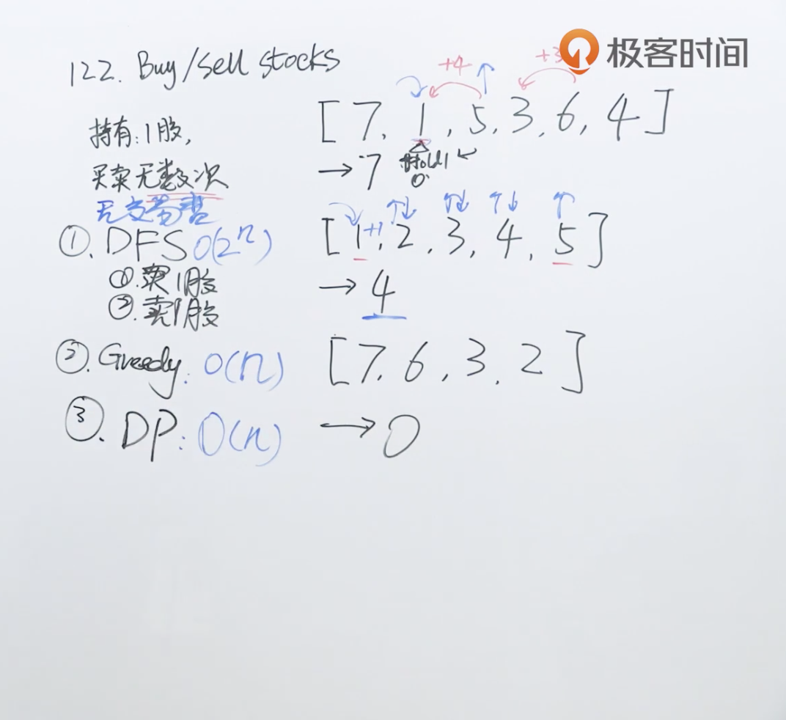

题目：给定一个数组 prices ，其中 prices[i] 是一支给定股票第 i 天的价格。

设计一个算法来计算你所能获取的最大利润。你可以尽可能地完成更多的交易（多次买卖一支股票）。

注意：你不能同时参与多笔交易（你必须在再次购买前出售掉之前的股票）。

示例1：

```shell
输入: prices = [7,1,5,3,6,4]
输出: 7
解释: 在第 2 天（股票价格 = 1）的时候买入，在第 3 天（股票价格 = 5）的时候卖出, 这笔交易所能获得利润 = 5-1 = 4 。
     随后，在第 4 天（股票价格 = 3）的时候买入，在第 5 天（股票价格 = 6）的时候卖出, 这笔交易所能获得利润 = 6-3 = 3 。
```

示例2：

```shell
输入: prices = [1,2,3,4,5]
输出: 4
解释: 在第 1 天（股票价格 = 1）的时候买入，在第 5 天 （股票价格 = 5）的时候卖出, 这笔交易所能获得利润 = 5-1 = 4 。
     注意你不能在第 1 天和第 2 天接连购买股票，之后再将它们卖出。因为这样属于同时参与了多笔交易，你必须在再次购买前出售掉之前的股票。
```

解题思路：本题是一道解法很多的题目，目前学习到贪心算法，但贪心算法的局限性很多，一是交易无手续费，二是当天买卖可以无数次，后面学习到动态规划，会使用动态规划进行求解。



代码：

```java
class Solution {
    public int maxProfit(int[] prices) {
      	//设置收益初始值
        int profit = 0;
      	//遍历整个数组，只要后面一天的股价大于前一天的股价就进行购入
        for (int i = 0; i < prices.length; i++) {
          	//终止条件i+1必须小于prices.length，否则会数组下标越界
            if ((i+1 < prices.length)  && (prices[i+1] > prices[i])) {
                profit += (prices[i+1] - prices[i]);
            }
        }
        return profit;
    }
}
```

