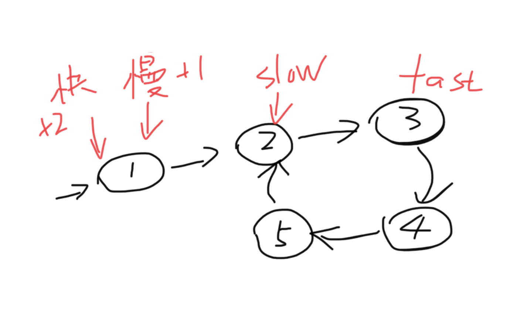

题目：给定一个链表，判断链表中是否有环。

如果链表中有某个节点，可以通过连续跟踪 next 指针再次到达，则链表中存在环。 为了表示给定链表中的环，我们使用整数 pos 来表示链表尾连接到链表中的位置（索引从 0 开始）。 如果 pos 是 -1，则在该链表中没有环。注意：pos 不作为参数进行传递，仅仅是为了标识链表的实际情况。

如果链表中存在环，则返回 `true` 。 否则，返回 `false` 。

示例：

```shell
输入：head = [3,2,0,-4], pos = 1
输出：true
解释：链表中有一个环，其尾部连接到第二个节点。
```

解题思路：本题有多种解法，可以逐个迭代，但有一种特殊的思路，使用快慢指针，快指针每次走两步，慢指针每次走一步，如果快慢指针相遇，则证明该链表有环。



代码：

```java
/**
 * Definition for singly-linked list.
 * class ListNode {
 *     int val;
 *     ListNode next;
 *     ListNode(int x) {
 *         val = x;
 *         next = null;
 *     }
 * }
 */
public class Solution {
    public static boolean hasCycle(ListNode head) {
        //快慢指针，类似于龟兔赛跑，快指针一次走两步，慢指针一次走一步，当两个指针重合的情况表示有环
        ListNode fast = head;
        ListNode slow = head;
      	//当快指针、满指针和快指针的下一个节点为空，即走到头，也没有相遇时，返回false
        while(fast !=null && slow != null & fast.next != null){
            slow = slow.next;
            fast = fast.next.next;
            if (slow == fast) {
                return true;
            }
        }
        return false;
    }
}
```


