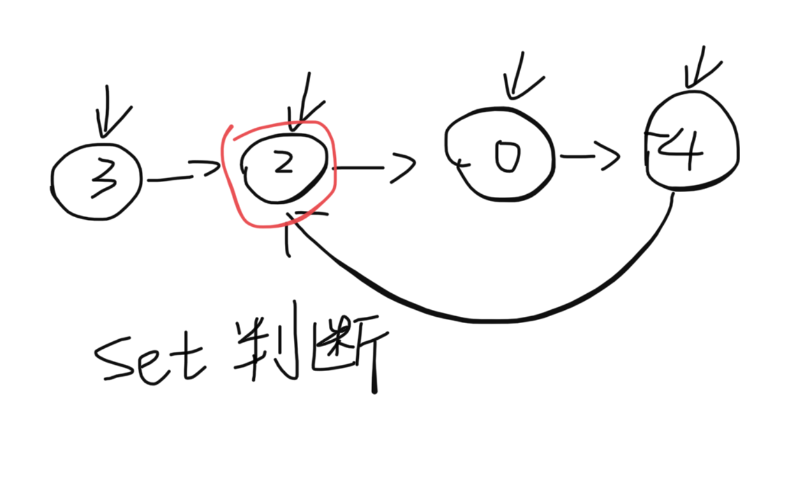

题目：给定一个链表，返回链表开始入环的第一个节点。 如果链表无环，则返回 `null`。

为了表示给定链表中的环，我们使用整数 pos 来表示链表尾连接到链表中的位置（索引从 0 开始）。 如果 pos 是 -1，则在该链表中没有环。注意，pos 仅仅是用于标识环的情况，并不会作为参数传递到函数中。

示例：	

```shell
输入：head = [3,2,0,-4], pos = 1
输出：返回索引为 1 的链表节点
解释：链表中有一个环，其尾部连接到第二个节点。
```

解题思路：此题和141题实际上一样，141的使用set的方法此题同样可以使用，只是需要返回入环的第一个节点，因此不能被add进set的那个节点就是第一个节点。



代码：

```java
/**
 * Definition for singly-linked list.
 * class ListNode {
 *     int val;
 *     ListNode next;
 *     ListNode(int x) {
 *         val = x;
 *         next = null;
 *     }
 * }
 */
public class Solution {
    public ListNode detectCycle(ListNode head) {
        ListNode next = head;
        HashSet<ListNode> set = new HashSet<>();
      	//遍历链表
        while (next != null && next.next != null) {
          	//利用set无序且不重复的特点，当节点不能添加进set时，该节点为入环的第一个节点
            if(!set.add(next)) {
                return next;
            }
            next = next.next;
        }
        return null;
    }
}
```

