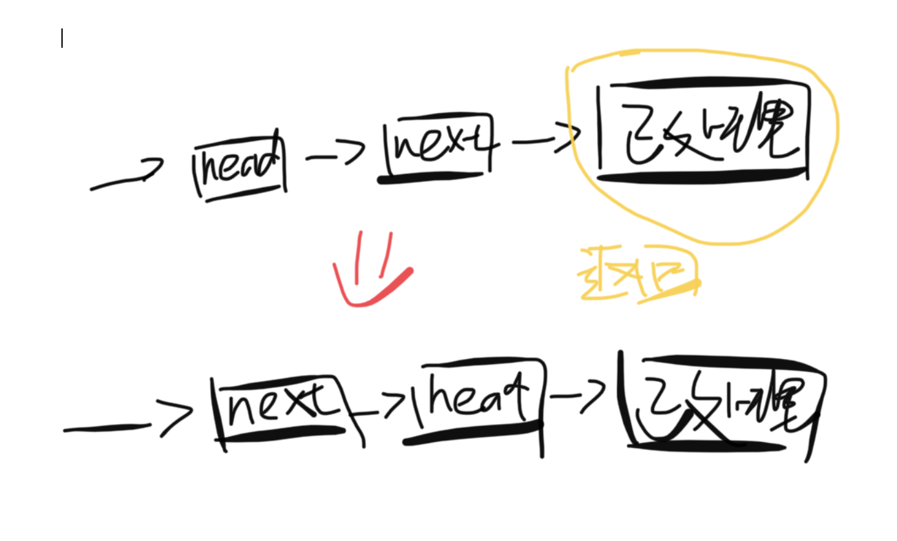

题目：给定一个链表，两两交换其中相邻的节点，并返回交换后的链表。

示例：

```shell
输入：head = [1,2,3,4]
输出：[2,1,4,3]
```

解题思路：该题是一道递归典型，递归三要素：1、找终止条件；2、找返回值；3、本级递归做什么。

- ** 终止条件： **head 为空指针或者 next 为空指针，也就是当前无节点或者只有一个节点，无法进行交换
- ** 返回值： **已处理完的链表
- ** 本级递归： **设需要交换的两个点为 head 和 next，head 连接后面交换完成的子链表，next 连接 head，完成交换



代码：

```java
class Solution {
    public ListNode swapPairs(ListNode head) {
        //head指针所指的节点为空，或者只剩一个节点，无法进行交换，就返回head指针所指的处理完的链表
        if(head == null || head.next == null){
            return head;
        }
        //获取head指针的下一个节点next指针所指的节点
        ListNode next = head.next;
      	//将head指针所指的节点更换为已处理完的链表
        head.next = swapPairs(next.next);
      	//将next指针所指的节点更换为head指针所指的节点
        next.next = head;
      	//返回next指针所指的处理完的链表
        return next;
    }
}
```

